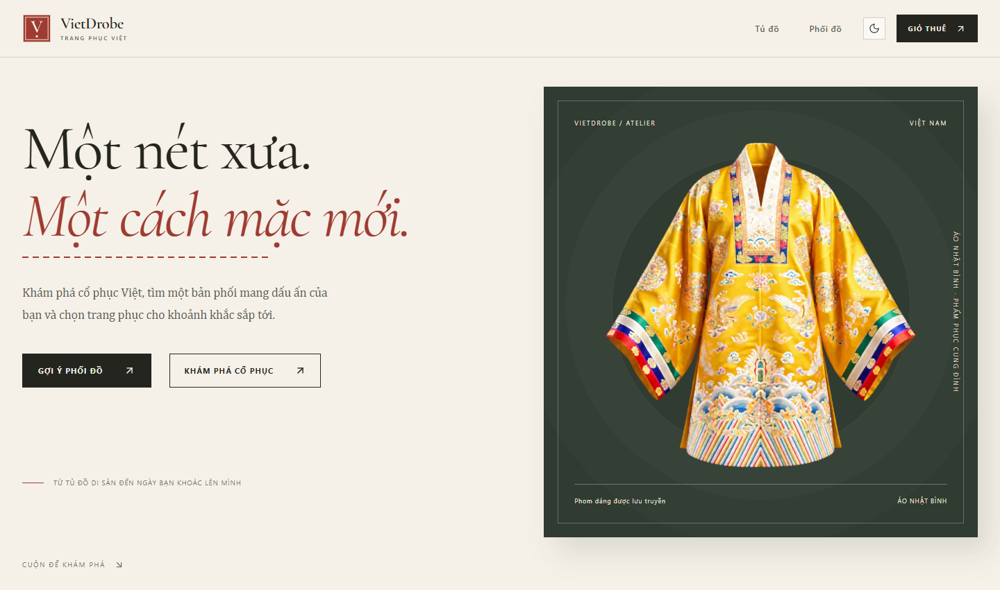
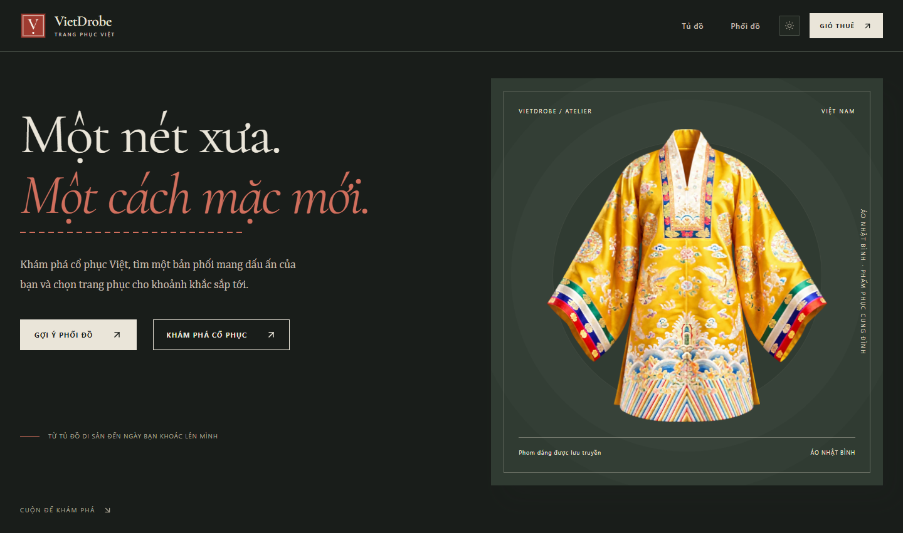
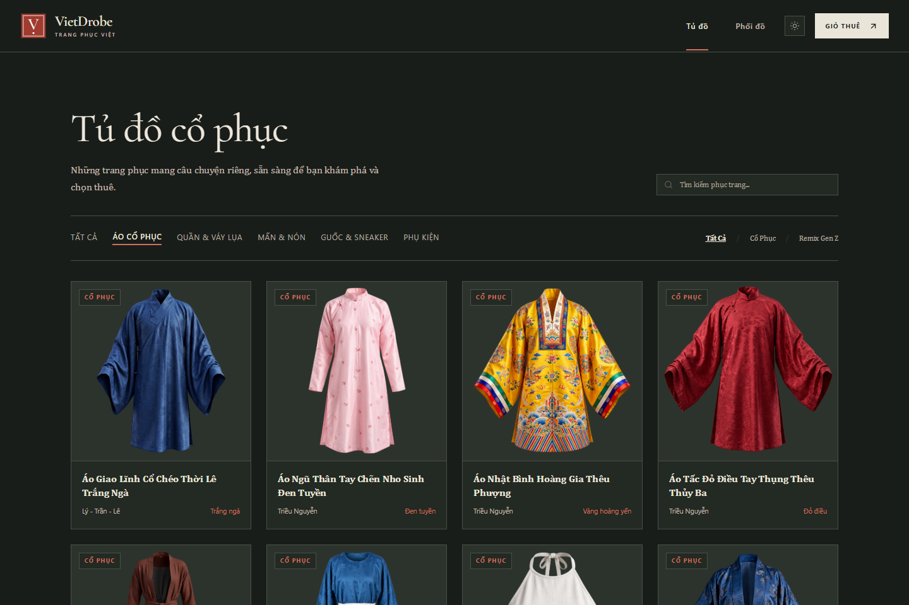
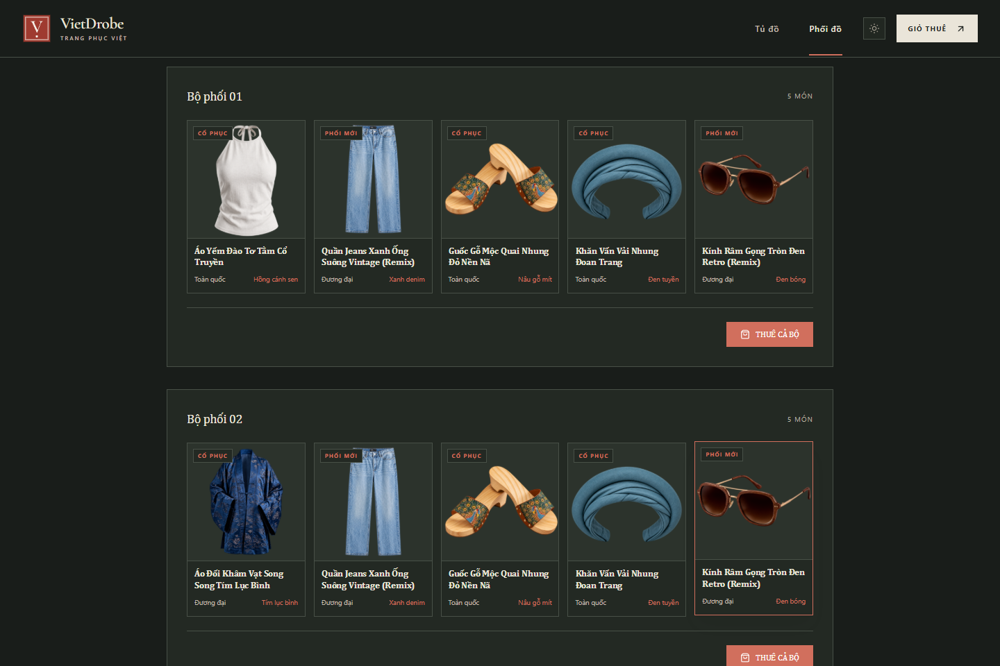
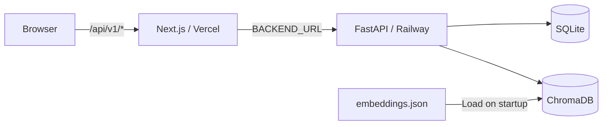

<p align="center">
  
</p>

<h1 align="center">VietDrobe</h1>

<p align="center">
  <strong>Một nét xưa. Một cách mặc mới.</strong><br>
  Explore Vietnamese heritage. Find your outfit. Make it your own.
</p>

<p align="center">
  <a href="https://nextjs.org/"></a>
  <a href="https://fastapi.tiangolo.com/"></a>
  <a href="https://www.python.org/"></a>
  <a href="https://www.docker.com/"></a>
</p>

<p align="center">
  <a href="https://viet-drobe.vercel.app"><strong>Live demo</strong></a> ·
  <a href="#features">Features</a> ·
  <a href="#screenshots">Screenshots</a> ·
  <a href="#quick-start">Quick start</a> ·
  <a href="#deployment">Deployment</a> ·
  <a href="#architecture">Architecture</a> ·
  <a href="#contributing">Contributing</a>
</p>

VietDrobe brings Vietnamese traditional clothing into everyday outfit planning. Browse the collection, choose an occasion and style, explore suggested combinations, and create a rental booking. The app interface is in Vietnamese.

## Features

- **Heritage catalog** — 25 garments with cultural context, category filters, traditional/modern filters, and name search.
- **Semantic outfit suggestions** — choose from 5 occasions, 4 styles, and 3 gender options to receive up to 3 complete outfit suggestions.
- **Pin a favorite** — select an item in the quiz and keep it in compatible suggestions while it is in stock.
- **Cultural checks** — evaluate combinations against the repository's clothing rules, with scores and warnings shown alongside results.
- **Rental flow** — select sizes, quantities, and dates; preview pricing, a 15% discount for at least 3 distinct items, and a deposit equal to 30% of the discounted rental price.
- **Light and dark themes** — a responsive interface with square, transparent catalog sprites and an editorial design inspired by Vietnamese heritage.

## Screenshots

### Landing page

| Light theme | Dark theme |
|---|---|
| [](docs/images/landing-light.png) | [](docs/images/landing-dark.png) |

### Catalog and outfit suggestions

| Browse traditional clothing | Find an outfit |
|---|---|
| [](docs/images/catalog.png) | [](docs/images/suggestions.png) |

Screenshots use the live catalog and real suggestion results. Click an image to view it at full size. [Screenshot details](docs/images/README.md).

## Quick start

### Docker Compose

Install [Docker Desktop](https://www.docker.com/products/docker-desktop/) and Git, then run:

```bash
git clone https://github.com/bob354/VietDrobe.git
cd VietDrobe
docker compose up --build -d
```

The containers are built from source. On startup, the backend creates its tables, syncs the catalog and sprites, and loads the committed embedding vectors. SQLite and the Chroma index persist in `backend/data/` through the Compose volume.

| Service | Local address |
|---|---|
| Website | http://localhost:3000 |
| API documentation, with `DEBUG=true` | http://localhost:8000/docs |
| Health check | http://localhost:8000/api/v1/health |

```bash
docker compose logs -f backend frontend
docker compose down
```

### Windows launcher

With Python 3.12 and Node.js 20.9 or later installed, run `start.bat` from the repository root. It checks dependencies, starts both services, and opens the website. Use `stop.bat` to stop the local services.

For virtual environments, manual setup, and build checks, see the [development guide](docs/DEVELOPMENT.md).

## Deployment

The live demo uses **Vercel for the frontend** and **Railway for the backend**.

| Service | Project root | Required setup |
|---|---|---|
| Railway | `backend` | Dockerfile, persistent volume at `/app/data`, public domain |
| Vercel | `frontend` | Next.js, `BACKEND_URL` set to the Railway public HTTPS origin |

Frontend requests use `/api/v1/*` on the website's own origin. A rewrite forwards them to the backend. Update `BACKEND_URL` and redeploy the frontend whenever the backend domain changes.

The [deployment guide](docs/DEPLOYMENT.md) covers the exact variables, volume configuration, port, health checks, and troubleshooting.

## Architecture



### How suggestions work

Each garment's search document combines inventory details with cultural information from its parent garment type. The Vietnamese SentenceTransformer `bkai-foundation-models/vietnamese-bi-encoder` creates embeddings, and ChromaDB retrieves relevant items. The backend assembles tops, bottoms, and optional accessories, blends in pinned items, and checks each combination against the cultural rules.

The committed bundle contains **25 garment vectors and 60 quiz vectors**. With a current bundle, the standard quiz works without downloading the model or providing an API key.

**Rebuild and commit `embeddings.json` whenever catalog text or quiz queries change.** A stale bundle can leave suggestions empty, incomplete, or unavailable. See [catalog and embedding maintenance](docs/DEVELOPMENT.md#cập-nhật-catalog-và-embeddings).

### Tech stack

| Layer | Technology |
|---|---|
| Frontend | Next.js 16.3.5, React 19, TypeScript |
| Styling | Tailwind CSS 4, Lucide React |
| Backend | FastAPI, Uvicorn, Pydantic 2 |
| Database | SQLAlchemy async, SQLite / aiosqlite |
| Semantic search | SentenceTransformers, ChromaDB |
| Image handling | Pillow |
| Hosting | Docker Compose, Vercel, Railway |

<details>
<summary><strong>Repository structure and catalog data</strong></summary>

```text
backend/
  app/
    api/              # REST endpoints
    models/           # Garment types, inventory, outfits, bookings
    services/         # Recommendations, cultural checks, rentals, images
    seed/             # Catalog JSON, source sprites, embedding bundle
  scripts/            # Build and validate embeddings
  tests/              # Catalog, images, SQLite startup
frontend/
  app/                # Landing, catalog, suggestions, rental cart
  components/         # Shared interface components
  lib/                # API client, types, rental context
docs/                 # Setup guides and screenshots
docker-compose.yml
start.bat / stop.bat
```

`garment_types.json` holds shared cultural information by `type_id`. `inventory_items.json` holds each SKU by `item_id`, linked through `parent_type_id`. The current source sprites are 1254 × 1254 transparent PNGs in `backend/app/seed/garments/`.

Startup installs sprites into storage and syncs the catalog. Older database records are retained for saved outfits and bookings, while browsing uses only the current catalog.

</details>

<details>
<summary><strong>API overview</strong></summary>

All endpoints use the `/api/v1` prefix. Swagger is available locally at `/docs` when `DEBUG=true`.

| Method | Endpoint | Purpose |
|---|---|---|
| GET | `/health` | Startup health |
| GET | `/garments`, `/garments/{id}` | Browse garments and details |
| GET | `/garments/categories`, `/garment-types` | Categories and garment types |
| GET / HEAD | `/images/{path}` | Catalog images |
| POST | `/outfits/suggest` | Suggest outfits |
| POST / GET | `/outfits`, `/outfits/{id}` | Save and retrieve outfits |
| POST | `/cultural/check` | Check a clothing combination |
| GET | `/rentals/catalog` | Rental sizes, prices, and stock |
| POST | `/rentals/calculate`, `/rentals/book` | Calculate pricing and create a booking |
| GET | `/rentals/booking/{id}` | Retrieve a booking |

The health endpoint confirms the server has started. Test catalog loading and suggestions separately to verify those features.

</details>

## Contributing

Bug reports, documentation improvements, and pull requests are welcome. Include reproduction steps and relevant logs when reporting an issue.

Before submitting changes, run the applicable checks in the [development guide](docs/DEVELOPMENT.md#kiểm-tra). Catalog or quiz changes should include a rebuilt, validated embedding bundle. UI changes should refresh the README screenshots when needed.

## Current scope

VietDrobe is a prototype. Bookings are stored in SQLite; the rental cart uses React Context and resets on page reload. Online payments and booking administration are not integrated. Cultural checks implement the rules maintained in this repository.
